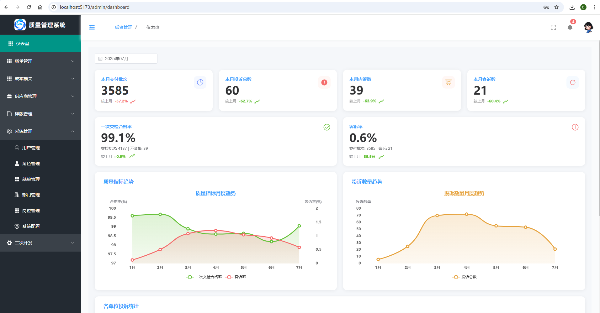
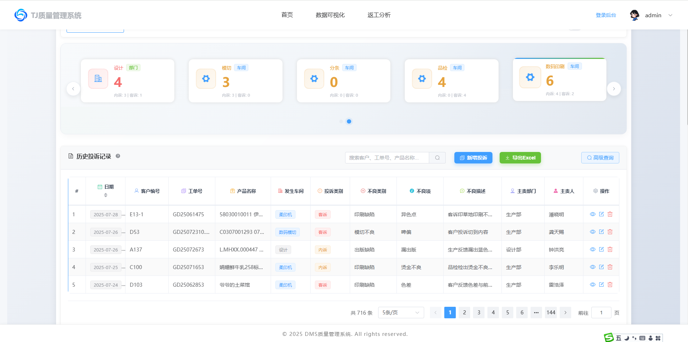

# DMS-QA 质量管理系统

[](https://opensource.org/licenses/Apache-2.0)
[](https://gitee.com/lbk168/dms-qa)
[](https://gitee.com/lbk168/dms-qa)

## 项目简介

DMS-QA 是一个基于 Vue 3 + Node.js + SQL Server 的质量管理系统，主要用于投诉登记和质量数据管理。

> 🚧 **开发状态**: 本项目正在积极开发中，功能持续完善和优化。

**版权所有 © 2024-2025 David Lee (zglibk)**

## 系统预览

> 🚧 **开发进度**: 系统核心功能已完成，正在持续优化用户体验和添加新特性。

### 登录界面
系统采用现代化的登录设计，支持用户名密码认证和记住登录状态功能。


### 首页仪表盘
提供直观的数据统计展示，包括今日投诉、本月投诉等关键指标，以及投诉记录的快速查看。


### 管理后台
管理员专用的数据分析界面，展示系统整体运行状况和关键业务指标。


### 系统配置
支持动态配置系统参数，包括网站LOGO、基本信息等个性化设置。


### 主页卡片配置
灵活的首页展示配置，管理员可以自定义显示的统计卡片和部门筛选选项。


> 📸 **截图说明**: 以上截图展示了系统的主要功能界面。实际截图文件请放置在 `docs/images/` 目录中。

## 技术栈

### 前端
- Vue 3
- Element Plus
- Vite
- Axios

### 后端
- Node.js
- Express
- SQL Server
- JWT 认证

## 项目结构

```
DMS-QA/
├── .devcontainer/
│   ├── README.md
│   ├── devcontainer.json
│   └── start-dev.sh
├── .gitignore
├── .nvmrc
├── .trae/
│   └── rules/
│       └── project_rules.md
├── LICENSE
├── NOTICE
├── README.md
├── VERSION_HISTORY.md
├── docs/
├── frontend/
│   ├── .env.example
│   ├── App.vue
│   ├── index.html
│   ├── main.js
│   ├── package-lock.json
│   ├── package-scripts.json
│   ├── package.json
│   ├── scripts/
│   │   └── deployment-check.js
│   ├── src/
│   │   ├── components/
│   │   ├── composables/
│   │   ├── config/
│   │   ├── examples/
│   │   ├── router/
│   │   ├── services/
│   │   ├── store/
│   │   ├── utils/
│   │   └── views/
│   ├── vite.config.js
│   └── vite.config.production.js
├── package-lock.json
├── package.json
├── push-to-all.ps1
├── scripts/
│   ├── check-environment.js
│   └── version-compatibility-test.js
└── server/
    ├── .env.example
    ├── .gitignore
    ├── app.js
    ├── config/
    │   ├── database.js
    │   ├── nginx-dms-qa-centosstream.conf
    │   ├── nginx-dms-qa-fixed.conf
    │   └── path-mapping.js
    ├── controllers/
    │   ├── noticeController.js
    │   └── workPlanController.js
    ├── db.js
    ├── init.sql
    ├── init_MySQL80.sql
    ├── insert_template_data.js
    ├── menu-formatted.json
    ├── menu-response.json
    ├── middleware/
    │   └── auth.js
    ├── package-lock.json
    ├── package.json
    ├── routes/
    │   ├── auth.js
    │   ├── complaint.js
    │   ├── config.js
    │   ├── customerComplaints.js
    │   ├── customerComplaintsBatch.js
    │   ├── departments.js
    │   ├── import.js
    │   ├── material-price-backup.js
    │   ├── material-price.js
    │   ├── menus.js
    │   ├── notice.js
    │   ├── person.js
    │   ├── positions.js
    │   ├── quality-metrics.js
    │   ├── rework.js
    │   ├── roles.js
    │   ├── sample.js
    │   ├── shared-files.js
    │   ├── supplierComplaints.js
    │   ├── upload.js
    │   └── workPlan.js
    ├── scripts/
    │   ├── DEPLOYMENT_SUMMARY.md
    │   ├── README.md
    │   ├── add-development-menus.js
    │   ├── add-development-menus.sql
    │   ├── add-supplier-complaints-menu.sql
    │   ├── add-supplier-complaints-new-fields.sql
    │   ├── add-work-plan-menus.sql
    │   ├── check-environment.ps1
    │   ├── create-supplier-complaints-table.sql
    │   ├── execute-add-fields.js
    │   ├── fix-attachment-paths-v2.js
    │   ├── fix-attachment-paths.js
    │   ├── fix_null_bit_fields.js
    │   ├── fix_null_bit_fields.sql
    │   ├── health-monitor.ps1
    │   ├── init-work-plan-menus.js
    │   ├── init-work-plan-tables.sql
    │   ├── install-all-services.ps1
    │   ├── install-nginx-service-fixed.ps1
    │   ├── install-node-service-fixed.ps1
    │   ├── install-nssm.ps1
    │   ├── install-services-english.ps1
    │   ├── run-init-tables.js
    │   ├── service-manager.ps1
    │   ├── update-responsible-person-field.js
    │   └── update-responsible-person-to-initiator.sql
    ├── services/
    │   └── fileCopyService.js
    ├── templates/
    │   └── complaint_template.xlsx
    ├── uploads/
    │   ├── .gitkeep
    │   ├── attachments/
    │   └── site-images/
    └── 质量等级数据库说明.md
```

## 功能特性

> 🔄 **持续更新**: 系统功能持续迭代中，新特性和优化不断加入。

### v2.2.1 新增功能 ✨ (2025-01-15)
- 🔐 **验证码安全增强** - 优化验证码过期检查逻辑，添加详细日志记录，提升登录安全性
- 🎨 **前端UI优化** - 优化前台主页导航栏菜单文字大小，提升桌面端和移动端的可读性
- 🧹 **系统清理优化** - 清除智能检测API地址配置，简化系统架构

### v2.2.1 问题修复 🔧 (2025-01-15)
- 🔑 **登录验证码问题修复** - 修复验证码已过期但仍能成功登录的竞态条件问题
- 📱 **移动端字体优化** - 修复移动端导航菜单文字过小的显示问题
- 🔧 **代码语法错误修复** - 修复变量名冲突导致的语法错误
- 📝 **日志记录完善** - 添加验证码生成、验证、清理等关键操作的日志记录

### v2.2.0 新增功能 ✨
- 🚀 **自动值守方案** - 完整的 Windows 服务自动值守解决方案，实现开机自启动和异常自动恢复
- 📊 **材料价格管理** - 支持供应商材料价格管理，历史价格追踪
- 🎨 **登录页面美化** - 新增波浪动画效果和浮动光晕，提升视觉体验
- 📝 **详细代码注释** - 为前后端所有核心文件添加详细中文注释，便于理解和维护
- 🔄 **智能数据转换** - 自动处理日期、数字等数据类型
- 📁 **文件自动拷贝** - Excel超链接文件自动拷贝到服务器
- ⚙️ **系统配置管理** - 数据库连接、存储路径等可视化配置
- 🎯 **高级查询优化** - 修复响应式定位问题，提升用户体验
- 🎨 **网站LOGO配置** - 支持动态上传和配置网站标识

### v2.2.0 问题修复 🔧
- 💰 **质量成本损失模块优化** - 修复面包屑导航中文映射问题，完善模块显示
- 🧭 **面包屑导航修复** - 修复样版管理和供应商管理面包屑点击空白页问题，添加父级路由重定向
- 🗑️ **项目文件清理** - 清理不需要的测试脚本和修复文件，保持项目结构整洁
- 🛠️ **菜单管理功能修复** - 修复后台管理菜单管理模块的数据库连接和字段映射问题
- 📊 **数据导入计数优化** - 修复Excel导入时计数不匹配问题，优化统计逻辑
- 🔤 **中文编码处理** - 改进中文路径编码处理，减少乱码问题
- 🗂️ **路径验证优化** - 无效路径记录保存但附件字段设为NULL，提高数据完整性

### 核心功能 🚀
- 🔐 **用户认证与授权** - 安全的登录验证机制
- 📊 **投诉登记管理** - 完整的投诉处理流程
- ⚙️ **动态数据库配置** - 灵活的数据库连接管理
- 📱 **响应式设计** - 适配各种设备屏幕
- 🎨 **现代化 UI 界面** - 基于 Element Plus 的美观界面
- 📈 **数据统计分析** - 实时的业务数据展示
- 🛡️ **自动值守服务** - Windows 服务化部署，支持开机自启动和异常自动恢复

### 开发中功能 🚧
- 📋 **报表生成** - 自定义报表和数据导出
- 🔔 **消息通知** - 实时消息推送系统
- 👥 **多角色权限** - 更细粒度的权限控制
- 🔍 **全文搜索** - 高级搜索和筛选功能

## 部署方案

### 🚀 自动值守部署（推荐）

**适用场景**: 生产环境、需要无人值守的服务器环境

使用 NSSM 将 Nginx 和 Node.js 转换为 Windows 服务，实现：
- ✅ **开机自启动** - 系统重启后自动启动服务
- ✅ **异常自动恢复** - 服务崩溃时自动重启
- ✅ **无人值守** - 无需手动干预即可持续运行
- ✅ **日志管理** - 自动日志轮转和管理

#### 快速部署
```powershell
# 以管理员身份运行 PowerShell
cd "server/scripts"

# 设置执行策略（首次运行）
Set-ExecutionPolicy -ExecutionPolicy RemoteSigned -Scope CurrentUser

# 环境检测
.\test-paths.ps1

# 一键安装服务
.\install-services-english.ps1
```

📖 **详细说明**: 请参阅 [自动值守部署指南](server/scripts/README.md)

### 🛠️ 开发环境部署

**适用场景**: 开发调试、功能测试

## 快速开始

> ⚡ **快速体验**: 系统已具备完整的运行环境，按照以下步骤即可快速启动体验。

### 环境要求

#### 推荐版本（已测试）
- **Node.js**: v18.20.8 (推荐使用此版本)
- **npm**: v10.8.2 或更高版本
- **SQL Server**: 2008R2 或更高版本
- **Git**: 最新版本

#### 最低版本要求
- **Node.js**: >= 16.0.0 (但强烈推荐使用 v18.20.8)
- **SQL Server**: 2008R2+
- **操作系统**: Windows 10/11, Linux, macOS

#### 版本兼容性说明
⚠️ **重要提示**: 不同Node.js版本可能导致依赖包兼容性问题，建议使用推荐版本以避免意外错误。

📖 **详细环境配置**: 请参阅 [环境配置指南](docs/环境配置指南.md) 获取完整的安装和配置说明。

#### 使用nvm管理Node.js版本

项目根目录包含`.nvmrc`文件，如果您使用nvm：

```bash
# 安装并使用推荐版本
nvm install
nvm use

# 或者手动指定版本
nvm install 18.20.8
nvm use 18.20.8
```

### 环境检查

我们提供了自动化环境检查脚本：

```bash
# 运行环境检查脚本
npm run check-env
```

或者手动检查：

```bash
# 检查Node.js版本
node --version
# 应该显示: v18.20.8 (推荐) 或 >= v16.0.0

# 检查npm版本
npm --version
# 应该显示: >= 8.0.0

# 检查Git版本
git --version
```

### 快速开始

```bash
# 一键安装所有依赖（推荐）
npm run setup

# 或者手动安装
# 安装前端依赖
cd frontend
npm install

# 安装后端依赖
cd ../server
npm install
```

#### 版本兼容性测试

```bash
# 测试当前Node.js版本兼容性
npm run test-version
```

#### 常见问题解决

如果遇到依赖安装问题：

```bash
# 清除npm缓存
npm cache clean --force

# 一键清理并重新安装所有依赖
npm run reinstall

# 手动清理（Linux/macOS）
rm -rf node_modules package-lock.json
npm install

# 手动清理（Windows PowerShell）
Remove-Item -Recurse -Force node_modules, package-lock.json
npm install
```

### 配置数据库

1. 确保 SQL Server 正在运行
2. 修改 `server/db.js` 中的数据库连接配置
3. 运行数据库初始化脚本

### 启动项目

```bash
# 一键启动前后端服务（推荐）
npm run dev

# 或者分别启动
# 启动后端服务 (端口 3001)
cd server
npm start

# 启动前端开发服务器 (端口 5173)
cd frontend
npm run dev
```

### 访问应用

#### 开发环境
- 前端地址: http://localhost:5173
- 后端 API: http://localhost:3001

#### 生产环境（自动值守部署）
- 前端地址: http://localhost （通过 Nginx 代理）
- 后端 API: http://localhost:3001

## 开发说明

> 🛠️ **开发友好**: 项目采用现代化的开发架构，支持热重载和快速迭代开发。

### 项目状态
- ✅ **核心功能**: 用户认证、投诉管理、数据统计等核心功能已完成
- ✅ **系统配置**: 动态配置、LOGO管理等系统设置功能已实现
- ✅ **Excel导入**: 完整的Excel数据导入和处理功能已上线
- ✅ **自动值守**: Windows 服务化部署方案已完成，支持生产环境无人值守
- 🚧 **持续优化**: UI/UX优化、性能提升、新功能开发持续进行中

### 自动值守部署

#### 🚀 Windows 服务化部署

系统提供完整的 Windows 服务自动值守解决方案：

**核心特性**:
- ✅ **开机自启动**: 系统重启后自动启动服务
- ✅ **异常自动恢复**: 服务崩溃时自动重启
- ✅ **无人值守**: 无需手动干预即可持续运行
- ✅ **日志管理**: 自动日志轮转和管理
- ✅ **服务监控**: 实时监控服务状态和系统资源

**部署要求**:
- Windows 10/11 或 Windows Server
- 管理员权限
- PowerShell 执行策略设置

**快速部署**:
```powershell
# 以管理员身份运行 PowerShell
cd "server/scripts"
Set-ExecutionPolicy -ExecutionPolicy RemoteSigned -Scope CurrentUser
.\install-services-english.ps1
```

**服务管理**:
```powershell
# 查看服务状态
Get-Service -Name "DMS-QA-*"

# 启动/停止服务
Start-Service -Name "DMS-QA-Nginx","DMS-QA-Backend"
Stop-Service -Name "DMS-QA-Nginx","DMS-QA-Backend"
```

📖 **详细文档**: [自动值守部署指南](server/scripts/README.md)

### 数据库配置

系统支持动态数据库配置，可以在运行时切换不同的数据库连接。支持 SQL Server 2008R2 及以上版本。

### API 接口

- `/api/auth/*` - 认证相关接口
- `/api/config/*` - 配置管理接口
- `/api/complaint/*` - 投诉管理接口
- `/api/excel/*` - Excel导入相关接口
- `/api/site-config/*` - 网站配置接口

### 开发进度

| 模块 | 状态 | 完成度 | 说明 |
|------|------|--------|------|
| 用户认证 | ✅ 完成 | 100% | 登录、权限验证 |
| 投诉管理 | ✅ 完成 | 98% | 核心功能完成，面包屑导航已修复 |
| 数据统计 | ✅ 完成 | 92% | 基础统计完成，图表优化中 |
| Excel导入 | ✅ 完成 | 98% | 功能完整，细节优化完成 |
| 系统配置 | ✅ 完成 | 95% | 基础配置完成，质量成本损失模块优化 |
| 供应商管理 | ✅ 完成 | 95% | 面包屑导航修复，功能完善 |
| 样版管理 | ✅ 完成 | 95% | 面包屑导航修复，数据库字段优化 |
| 质量成本损失 | ✅ 完成 | 90% | 模块重组完成，面包屑中文映射修复 |
| 自动值守 | ✅ 完成 | 100% | Windows 服务化部署，支持生产环境 |
| 报表功能 | 🚧 开发中 | 35% | 基础框架搭建中 |
| 消息通知 | 📋 计划中 | 0% | 需求分析阶段 |

## 贡献指南

1. Fork 本仓库
2. 创建特性分支 (`git checkout -b feature/AmazingFeature`)
3. 提交更改 (`git commit -m 'Add some AmazingFeature'`)
4. 推送到分支 (`git push origin feature/AmazingFeature`)
5. 打开 Pull Request

## 版权与许可证

**版权所有 © 2024-2025 David Lee (zglibk)**

本项目采用 Apache License 2.0 开源许可证。

- 📄 查看完整许可证: [LICENSE](LICENSE)
- 📋 第三方组件声明: [NOTICE](NOTICE)

### 许可证要点
- ✅ 允许商业使用
- ✅ 允许修改和分发
- ✅ 提供专利保护
- ⚠️ 必须保留版权声明
- ⚠️ 必须标明修改内容

## 联系方式

- **作者**: David Lee (zglibk)
- **邮箱**: 1039297691@qq.com
- **仓库**: https://gitee.com/lbk168/dms-qa

## 免责声明

本软件按"原样"提供，不提供任何明示或暗示的担保。在任何情况下，作者或版权持有人均不对任何索赔、损害或其他责任负责。
