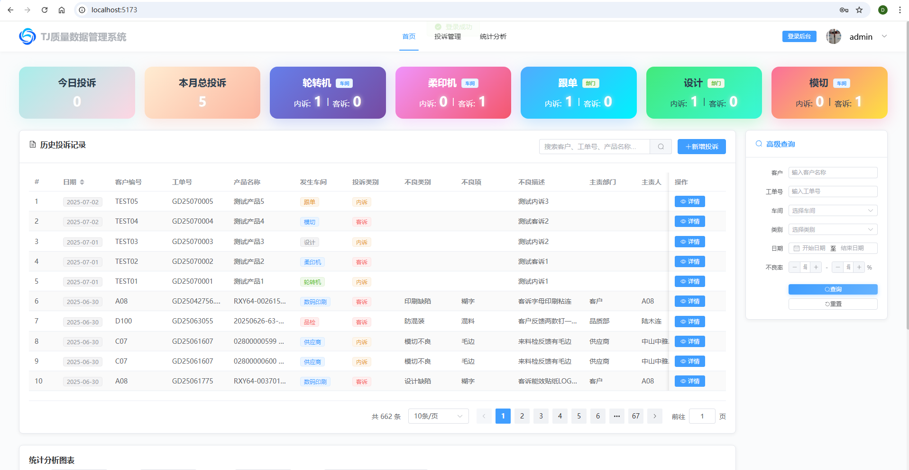

# DMS-QA 质量管理系统

[](https://opensource.org/licenses/Apache-2.0)
[](https://gitee.com/lbk168/dms-qa)
[](https://gitee.com/lbk168/dms-qa)

## 项目简介

DMS-QA 是一个基于 Vue 3 + Node.js + SQL Server 的质量管理系统，主要用于投诉登记和质量数据管理。

> 🚧 **开发状态**: 本项目正在积极开发中，功能持续完善和优化。

**版权所有 © 2024-2025 David Lee (zglibk)**

## 系统预览

> 🚧 **开发进度**: 系统核心功能已完成，正在持续优化用户体验和添加新特性。

### 登录界面
系统采用现代化的登录设计，支持用户名密码认证和记住登录状态功能。


### 首页仪表盘
提供直观的数据统计展示，包括今日投诉、本月投诉等关键指标，以及投诉记录的快速查看。


### 管理后台
管理员专用的数据分析界面，展示系统整体运行状况和关键业务指标。


### 系统配置
支持动态配置系统参数，包括网站LOGO、基本信息等个性化设置。


### 主页卡片配置
灵活的首页展示配置，管理员可以自定义显示的统计卡片和部门筛选选项。


> 📸 **截图说明**: 以上截图展示了系统的主要功能界面。实际截图文件请放置在 `docs/images/` 目录中。

## 技术栈

### 前端
- Vue 3
- Element Plus
- Vite
- Axios

### 后端
- Node.js
- Express
- SQL Server
- JWT 认证

## 项目结构

```
DMS-QA/
├── frontend/          # 前端项目
│   ├── src/
│   │   ├── views/     # 页面组件
│   │   ├── store/     # 状态管理
│   │   └── ...
│   ├── package.json
│   └── vite.config.js
├── server/            # 后端项目
│   ├── routes/        # 路由
│   ├── middleware/    # 中间件
│   ├── db.js         # 数据库配置
│   ├── app.js        # 应用入口
│   └── package.json
└── README.md
```

## 功能特性

> 🔄 **持续更新**: 系统功能持续迭代中，新特性和优化不断加入。

### v2.1.0 新增功能 ✨
- 📊 **Excel导入功能** - 支持多工作表选择和字段映射
- 🔄 **智能数据转换** - 自动处理日期、数字等数据类型
- 📁 **文件自动拷贝** - Excel超链接文件自动拷贝到服务器
- ⚙️ **系统配置管理** - 数据库连接、存储路径等可视化配置
- 🎯 **高级查询优化** - 修复响应式定位问题，提升用户体验
- 🎨 **网站LOGO配置** - 支持动态上传和配置网站标识

### 核心功能 🚀
- 🔐 **用户认证与授权** - 安全的登录验证机制
- 📊 **投诉登记管理** - 完整的投诉处理流程
- ⚙️ **动态数据库配置** - 灵活的数据库连接管理
- 📱 **响应式设计** - 适配各种设备屏幕
- 🎨 **现代化 UI 界面** - 基于 Element Plus 的美观界面
- 📈 **数据统计分析** - 实时的业务数据展示

### 开发中功能 🚧
- 📋 **报表生成** - 自定义报表和数据导出
- 🔔 **消息通知** - 实时消息推送系统
- 👥 **多角色权限** - 更细粒度的权限控制
- 🔍 **全文搜索** - 高级搜索和筛选功能

## 快速开始

> ⚡ **快速体验**: 系统已具备完整的运行环境，按照以下步骤即可快速启动体验。

### 环境要求

#### 推荐版本（已测试）
- **Node.js**: v18.20.8 (推荐使用此版本)
- **npm**: v10.8.2 或更高版本
- **SQL Server**: 2008R2 或更高版本
- **Git**: 最新版本

#### 最低版本要求
- **Node.js**: >= 16.0.0 (但强烈推荐使用 v18.20.8)
- **SQL Server**: 2008R2+
- **操作系统**: Windows 10/11, Linux, macOS

#### 版本兼容性说明
⚠️ **重要提示**: 不同Node.js版本可能导致依赖包兼容性问题，建议使用推荐版本以避免意外错误。

📖 **详细环境配置**: 请参阅 [环境配置指南](docs/环境配置指南.md) 获取完整的安装和配置说明。

#### 使用nvm管理Node.js版本

项目根目录包含`.nvmrc`文件，如果您使用nvm：

```bash
# 安装并使用推荐版本
nvm install
nvm use

# 或者手动指定版本
nvm install 18.20.8
nvm use 18.20.8
```

### 环境检查

我们提供了自动化环境检查脚本：

```bash
# 运行环境检查脚本
npm run check-env
```

或者手动检查：

```bash
# 检查Node.js版本
node --version
# 应该显示: v18.20.8 (推荐) 或 >= v16.0.0

# 检查npm版本
npm --version
# 应该显示: >= 8.0.0

# 检查Git版本
git --version
```

### 快速开始

```bash
# 一键安装所有依赖（推荐）
npm run setup

# 或者手动安装
# 安装前端依赖
cd frontend
npm install

# 安装后端依赖
cd ../server
npm install
```

#### 版本兼容性测试

```bash
# 测试当前Node.js版本兼容性
npm run test-version
```

#### 常见问题解决

如果遇到依赖安装问题：

```bash
# 清除npm缓存
npm cache clean --force

# 一键清理并重新安装所有依赖
npm run reinstall

# 手动清理（Linux/macOS）
rm -rf node_modules package-lock.json
npm install

# 手动清理（Windows PowerShell）
Remove-Item -Recurse -Force node_modules, package-lock.json
npm install
```

### 配置数据库

1. 确保 SQL Server 正在运行
2. 修改 `server/db.js` 中的数据库连接配置
3. 运行数据库初始化脚本

### 启动项目

```bash
# 一键启动前后端服务（推荐）
npm run dev

# 或者分别启动
# 启动后端服务 (端口 3001)
cd server
npm start

# 启动前端开发服务器 (端口 5173)
cd frontend
npm run dev
```

### 访问应用

- 前端地址: http://localhost:5173
- 后端 API: http://localhost:3001

## 开发说明

> 🛠️ **开发友好**: 项目采用现代化的开发架构，支持热重载和快速迭代开发。

### 项目状态
- ✅ **核心功能**: 用户认证、投诉管理、数据统计等核心功能已完成
- ✅ **系统配置**: 动态配置、LOGO管理等系统设置功能已实现
- ✅ **Excel导入**: 完整的Excel数据导入和处理功能已上线
- 🚧 **持续优化**: UI/UX优化、性能提升、新功能开发持续进行中

### 数据库配置

系统支持动态数据库配置，可以在运行时切换不同的数据库连接。支持 SQL Server 2008R2 及以上版本。

### API 接口

- `/api/auth/*` - 认证相关接口
- `/api/config/*` - 配置管理接口
- `/api/complaint/*` - 投诉管理接口
- `/api/excel/*` - Excel导入相关接口
- `/api/site-config/*` - 网站配置接口

### 开发进度

| 模块 | 状态 | 完成度 | 说明 |
|------|------|--------|------|
| 用户认证 | ✅ 完成 | 100% | 登录、权限验证 |
| 投诉管理 | ✅ 完成 | 95% | 核心功能完成，持续优化 |
| 数据统计 | ✅ 完成 | 90% | 基础统计完成，图表优化中 |
| Excel导入 | ✅ 完成 | 95% | 功能完整，细节优化中 |
| 系统配置 | ✅ 完成 | 90% | 基础配置完成，扩展功能开发中 |
| 报表功能 | 🚧 开发中 | 30% | 基础框架搭建中 |
| 消息通知 | 📋 计划中 | 0% | 需求分析阶段 |

## 贡献指南

1. Fork 本仓库
2. 创建特性分支 (`git checkout -b feature/AmazingFeature`)
3. 提交更改 (`git commit -m 'Add some AmazingFeature'`)
4. 推送到分支 (`git push origin feature/AmazingFeature`)
5. 打开 Pull Request

## 版权与许可证

**版权所有 © 2024-2025 David Lee (zglibk)**

本项目采用 Apache License 2.0 开源许可证。

- 📄 查看完整许可证: [LICENSE](LICENSE)
- 📋 第三方组件声明: [NOTICE](NOTICE)

### 许可证要点
- ✅ 允许商业使用
- ✅ 允许修改和分发
- ✅ 提供专利保护
- ⚠️ 必须保留版权声明
- ⚠️ 必须标明修改内容

## 联系方式

- **作者**: David Lee (zglibk)
- **邮箱**: 1039297691@qq.com
- **仓库**: https://gitee.com/lbk168/dms-qa

## 免责声明

本软件按"原样"提供，不提供任何明示或暗示的担保。在任何情况下，作者或版权持有人均不对任何索赔、损害或其他责任负责。
