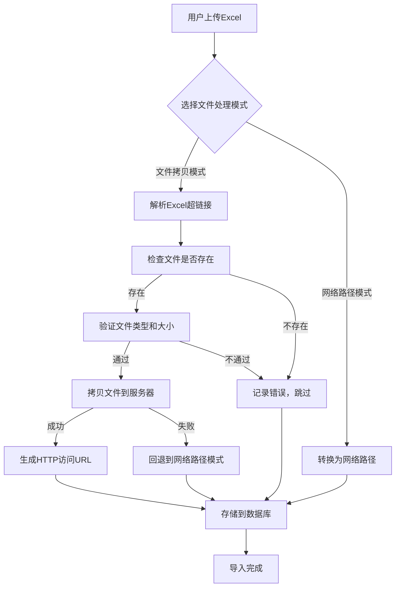

# 文件自动拷贝解决方案

## 🎯 **解决方案概述**

基于您的建议，我们实现了一个更加可靠的文件处理方案：**自动拷贝文件到服务器**。这种方式通过将Excel中引用的本地文件自动拷贝到服务器指定目录，然后生成HTTP访问链接，确保文件在局域网内任何设备上都能稳定访问。

## 🔧 **核心特性**

### 1. **动态服务器IP配置**
- 自动从DbConfig表获取当前数据库服务器IP
- 动态生成HTTP访问URL，无需硬编码IP地址
- 支持配置切换时自动更新文件访问地址

### 2. **智能文件拷贝**
- 自动检测Excel超链接中的本地文件路径
- 支持多种路径格式：`C:\path\file.jpg`、`file:///C:/path/file.jpg`
- 生成唯一文件名，避免文件名冲突
- 保留原始文件名信息，便于识别

### 3. **安全控制**
- 文件类型白名单：仅允许图片、文档、视频等安全文件类型
- 文件大小限制：默认50MB，可配置
- 自动文件名清理：移除特殊字符，防止路径注入

### 4. **容错机制**
- 文件拷贝失败时自动回退到网络路径模式
- 详细的错误日志和用户提示
- 批量处理时单个文件失败不影响其他文件

## 📁 **文件结构**

```
server/
├── services/
│   └── fileCopyService.js          # 文件拷贝服务核心
├── config/
│   └── path-mapping.js             # 路径映射配置（已更新）
├── routes/
│   └── import.js                   # 导入路由（已更新）
├── uploads/
│   └── attachments/                # 拷贝文件存储目录
└── app.js                          # 静态文件服务配置
```

## 🚀 **使用方式**

### 前端操作
1. 在Excel导入页面，用户可以选择**文件处理模式**：
   - ✅ **自动拷贝文件到服务器**（推荐）
   - 📁 **使用网络路径访问**

2. 选择拷贝模式后，系统会：
   - 自动检测Excel中的文件超链接
   - 将本地文件拷贝到服务器
   - 生成HTTP访问链接存储到数据库

### API接口
```javascript
// 测试文件拷贝
POST /api/import/test-file-copy
{
  "filePath": "C:\\Users\\Documents\\图片\\产品缺陷.jpg"
}

// 执行导入（支持文件拷贝）
POST /api/import/execute-with-copy
FormData: {
  file: Excel文件,
  enableFileCopy: true,
  // ... 其他参数
}
```

## 📊 **转换示例**

| 原始Excel超链接 | 拷贝后的HTTP URL |
|----------------|------------------|
| `C:\Users\Documents\产品缺陷.jpg` | `http://192.168.1.57:8080/files/attachments/1751108700529_91647b2b_产品缺陷.jpg` |
| `file:///D:/质量报告/2024年度.pdf` | `http://192.168.1.57:8080/files/attachments/1751108700530_a1b2c3d4_2024年度.pdf` |
| `E:\工厂照片\设备故障.png` | `http://192.168.1.57:8080/files/attachments/1751108700531_e5f6g7h8_设备故障.png` |

## 🔧 **配置说明**

### 文件拷贝配置
```javascript
// server/config/path-mapping.js
accessMethods: {
  fileCopy: {
    enabled: true,
    targetDirectory: '/uploads/attachments',
    urlPrefix: '/files/attachments',
    maxFileSize: 50 * 1024 * 1024, // 50MB
    allowedExtensions: ['.jpg', '.jpeg', '.png', '.gif', '.pdf', '.doc', '.docx']
  }
}
```

### 静态文件服务
```javascript
// server/app.js
app.use('/files/attachments', express.static(path.join(__dirname, 'uploads/attachments')));
```

## ✅ **优势对比**

| 特性 | 文件拷贝模式 | 网络路径模式 | Blob URL模式 |
|------|-------------|-------------|-------------|
| **跨设备访问** | ✅ 完全支持 | ⚠️ 需要配置共享 | ❌ 不支持 |
| **文件持久性** | ✅ 永久存储 | ⚠️ 依赖原文件 | ❌ 临时有效 |
| **访问稳定性** | ✅ 高度稳定 | ⚠️ 依赖网络共享 | ❌ 会话相关 |
| **部署复杂度** | ✅ 简单 | ⚠️ 需要配置共享 | ✅ 简单 |
| **存储空间** | ⚠️ 占用服务器空间 | ✅ 不占用 | ✅ 不占用 |
| **文件安全** | ✅ 服务器控制 | ⚠️ 依赖共享权限 | ❌ 无控制 |

## 🔄 **工作流程**



## 🛠️ **部署步骤**

### 1. 服务器端配置
```bash
# 确保uploads目录存在
mkdir -p server/uploads/attachments

# 设置目录权限
chmod 755 server/uploads/attachments
```

### 2. 前端配置
- 文件处理模式选择已集成到Excel导入页面
- 用户可在确认导入步骤中选择处理方式

### 3. 测试验证
```bash
# 测试API接口
curl -X POST http://localhost:3001/api/import/test-file-copy \
  -H "Content-Type: application/json" \
  -d '{"filePath": "C:\\path\\to\\test.jpg"}'
```

或者使用前端管理界面中的"文件拷贝测试"页面进行功能验证。

## 📈 **性能优化**

1. **异步处理**：文件拷贝采用异步操作，不阻塞主线程
2. **批量处理**：支持批量文件拷贝，提高效率
3. **错误隔离**：单个文件失败不影响整体导入
4. **进度反馈**：实时显示文件拷贝进度

## 🔒 **安全考虑**

1. **文件类型限制**：仅允许安全的文件类型
2. **文件大小限制**：防止大文件占用过多存储空间
3. **路径清理**：自动清理文件名中的特殊字符
4. **访问控制**：通过HTTP服务器控制文件访问权限

## 🎯 **总结**

这个文件自动拷贝解决方案完美解决了Excel超链接在局域网环境下的访问问题：

1. **彻底解决跨设备访问**：文件拷贝到服务器后，任何设备都能通过HTTP访问
2. **动态IP支持**：自动从数据库配置获取服务器IP，支持环境切换
3. **高可靠性**：文件持久化存储，不依赖原始文件位置
4. **用户友好**：提供可视化的模式选择，操作简单直观
5. **容错能力强**：多重回退机制，确保导入过程稳定

这种方案特别适合企业内部系统，既保证了文件的可访问性，又提供了良好的用户体验。
